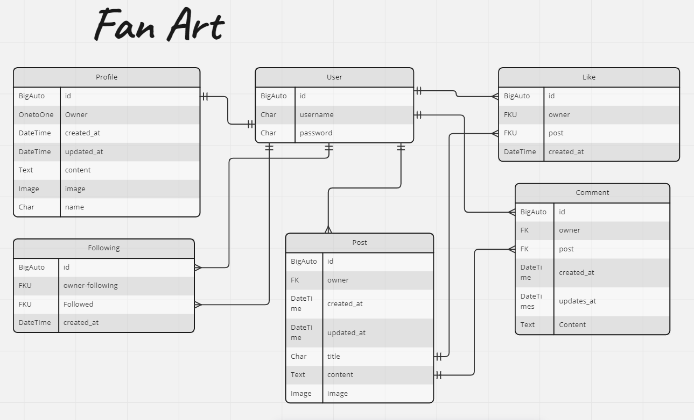

# Fan Art API
Fan Art is a content sharing website for people who like to create artwork based on their favourite things.

This repository is the backend of the application using the Django REST Framework(DRF) holding the API database for the front end part of the application.

## Links
[The deployed API](https://fan-art-drf-api.herokuapp.com/)  
[The deployed site](https://fan-art.herokuapp.com/)  
[The Frontend repository](https://github.com/AnnieNeilson/fan-art)  
[My Github Project](https://github.com/users/AnnieNeilson/projects/4)

## Contents
- [Database Schema](#database-schema)
- [Testing](#testing)
- [Technologies Used](#technologies-used)
- [Deployment](#deployment)
- [Credits](#credits)
  
## Database Schema
I created this Entity relationship diagram to help visualise the backend of this project

## Testing

### Manual Testing
Testing User Stories

1. Admin Profiles List: As an admin, I would like to be able to view all profiles so that I can moderate them for inappropriate content.
* I visited the [admin site](https://fan-art-drf-api.herokuapp.com/admin/) and logged in with the admin credentials. From there I followed the link to Profiles, I'm presented with a list of profiles. I can visit any profile and see the details of their profile

2. User Sign In: As a web server I would like to be able to authenticate user credentials so that users can sign in and use the site.
* 

### Validator Testing

## Technologies Used

### Languages
* Python  
-- The Django REST Framework base language

### Frameworks, libraries, and Programs
* Cloudinary
-- storage of images
* Pillow  
-- image processing capabilities
* Git  
-- For version control, committing and pushing to Github
* Github  
-- For storing the repository, files and images pushed from Gitpod
* Gitpod  
-- IDE used to code project
* Heroku  
-- Used to deploy the application
* Django Rest Auth
* PostgreSQL
* Cors headers

## Deployment

## Prepare API for deployment to Heroku

## Deployment to Heroku

## Credits

I referenced [this README.md file](https://github.com/Mrst12/pp5-backend-drf-appy-families/blob/main/README.md) for help with the structure and layout of this README.md file.

## Acknowledgements