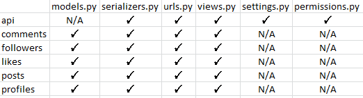
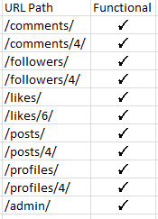

# Fan Art API
Fan Art is a content sharing website for people who like to create artwork based on their favourite things.

This repository is the backend of the application using the Django REST Framework(DRF) holding the API database for the front end part of the application.

## Links
[The deployed API](https://fan-art-drf-api.herokuapp.com/)  
[The deployed site](https://fan-art.herokuapp.com/)  
[The Frontend repository](https://github.com/AnnieNeilson/fan-art)  
[My Github Project](https://github.com/users/AnnieNeilson/projects/4)

## Contents
- [Database Schema](#database-schema)
- [Technologies Used](#technologies-used)
    * [Languages](#languages)
    * [Frameworks, Libraries and Programs](#frameworks-libraries-and-programs)
- [Testing](#testing)
    * [Validator Testing](#validator-testing)
    * [Manual Testing](#manual-testing)
        * [Testing User Stories](#testing-user-stories)
        * [Url Path Testing](#url-path-testing)
- [Deployment](#deployment)
- [Credits](#credits)
  
## Database Schema
I created this Entity relationship diagram to help visualise the backend of this project


## Technologies Used

### Languages
* Python  
-- The Django REST Framework base language

### Frameworks, Libraries and Programs
* Cloudinary  
-- storage of images
* Pillow  
-- image processing capabilities
* Git  
-- For version control, committing and pushing to Github
* Github  
-- For storing the repository, files and images pushed from Gitpod
* Gitpod  
-- IDE used to code project
* Heroku  
-- Used to deploy the application
* Django Rest Auth
* PostgreSQL
* Cors headers


## Testing

### Validator Testing

I ran the files from this project through an online PEP8 validator and recorded the results in the following table:  


### Manual Testing
#### Testing User Stories

1. Admin Profiles List: As an admin, I would like to be able to view all profiles so that I can moderate them for inappropriate content.
* I visited the [admin site](https://fan-art-drf-api.herokuapp.com/admin/) and logged in with the admin credentials. From there I followed the link to Profiles, I'm presented with a list of profiles. I can visit any profile and see the details of their profile

2. User Sign In: As a web server I would like to be able to authenticate user credentials so that users can sign in and use the site.
* I signed in successfully as a user

3. User Sign Up: As a web server I can POST a user to the database so that new users can register for the site.
* I signed up as a new user and noted that the API had a record of this new account

4. User Sign Out: As a web server I can POST an empty object so that users can logout of the site.
* I was able to successfully sign out.

5. GET Profile: As a web server I can get a specific user profile so that it can be displayed to the user.
* Using the user id of the profile I wanted to see, I was able to retrieve the correct profile data

6. Update Profile: As a web server I can PUT an updated profile in the database so that users can update their profiles.
* Whilst signed in I updated my username, the database updated the information

7. GET Filtered Posts: As a web server I can retrieve a list of filtered posts so that the user can search for specific posts.
* I used the search function available in the deployed site, it was fully functional

8. GET Filtered Posts: As a web server I can retrieve a list of filtered profiles so that users can search for specific profiles.
* I used the search function available in the deployed site, it was fully functional

9. Get Post List: As a web server I can retrieve a list of posts so that they can be displayed to the users.
* Using the url ending with '/posts/' I can see all posts listed. 

10. GET Post: As a web server I can retrieve a specific post so that it can be displayed to the user
* Using a url with the post id I retrieved the post data, using the link on the deployed site works as well

11. DELETE Post: As a web server I can delete a specific post so that the user can delete their post
* When accessing the delete function from the deployed site the instance is removed from the database

12. PUT Post: As a web server I can PUT an updated post so that the user can edit their post
* When accessing the edit function from the deployed site the instance is updated in the database

13. POST Post: As a web server I can PUT a new post so that the user can create a new post
* When submitting a new post to the deployed site the instance is created in the database

14. POST Comment: As a web server I can POST a comment to a post so that the user can create a comment
* When submitting a new comment to the deployed site the instance is created in the database

15. PUT Comment: As a web server I can PUT an updated comment so that users can update their comments
* When accessing the edit function from the deployed site the instance is updated in the database

16. DELETE Comment: As a web server I can delete a specific so that users can delete comments
* When accessing the delete function from the deployed site the instance is removed from the database

17. GET Comment List: As a web server I can retrieve the comments on a specific post so that it can be displayed to the user
* Using the url ending with '/comments/' I can see all comments listed. 

18. GET Sorted and Filtered Posts: As a web server I can retrieve a sorted and filtered posts so that popular items can be shown to the users
* When accessing the search feature on the deployed site the filtered results are displayed with more recent posts first

19. GET Sorted and Filtered Posts: As a web server I can retrieve sorted and filtered profiles so that they can be displayed to the user
* When accessing the search feature on the deployed site the filtered results, posts by users matching the search term, are displayed with more recent posts first

#### Url Path Testing

I tested all the url paths and recorded the results in the following table:  


## Deployment

1. Log in to Heroku and create a new app  
2. Click on the settings tab, Add a config var called DATABASE_URL and add the database as the value  
3. Back in the workspace, in the terminal, install dj_database_url and psycopg2  
4. In settings.py file, import dj_database_url underneath the import for os  
5. Update the DATABASES section to the following:  
```
 if 'DEV' in os.environ:
     DATABASES = {
         'default': {
             'ENGINE': 'django.db.backends.sqlite3',
             'NAME': BASE_DIR / 'db.sqlite3',
         }
     }
 else:
     DATABASES = {
         'default': dj_database_url.parse(os.environ.get("DATABASE_URL"))
     }
```
6. In the env.py file, add a new environment variable with the key set to DATABASE_URL, and the value to the database URL
7. Temporarily comment out the DEV environment variable
8. In the terminal, -–dry-run makemigrations to confirm the connection to the external database
9. Migrate the database models to the new database
10. Create a superuser for the new database, follow the steps to set the username and password  
11. Confirm the database is connected
12. In the terminal install gunicorn
13. Update the requirements file with terminal command pip freeze > requirements.txt
14. Create a Procfile and add the following commands:
```
 release: python manage.py makemigrations && python manage.py migrate
 web: gunicorn drf_api.wsgi
```
15. In settings.py update the ALLOWED_HOSTS variable to include the heroku app url
16. Add corsheaders to INSTALLED_APPS, and corsheaders middleware to MIDDLEWARE, ensuring it is at the top
17. Under the MIDDLEWARE list, set the ALLOWED_ORIGINS for the network requests made to the server.
18. Enable sending cookies in cross-origin requests
19. To be able to have the front end app and the API deployed to different platforms, set the JWT_AUTH_SAMESITE attribute to 'None'
20. Remove the value for SECRET_KEY and replace with "os.getenv('SECRET_KEY')" to use an environment variable instead
21. Set a NEW value for your SECRET_KEY environment variable in env.py
22. Set the DEBUG variable to "'DEV' in os.environ"
23. Comment DEV back into env.py (undoing what I did in step 7)
24. Ensure the requirements are up to date with terminal command pip freeze --local > requirements.txt
25. Add, commit and push code to GitHub

Back in Heroku
26. Open the settings tab and add two more config vars, SECRET_KEY and CLOUDINARY_URL
27. Open the Deploy tab and connect to GitHub, select the correct repository
28. Select Manual Deploy and click Depoly Branch, once the build process is complete the app will be ready to open and use.

## Credits

* The Code Institute Django REST Framework walk through was used as a guide to this project.
* I referenced [this README.md file](https://github.com/Mrst12/pp5-backend-drf-appy-families/blob/main/README.md) by Lisa Tinmurth for help with the structure and layout of this README.md file.